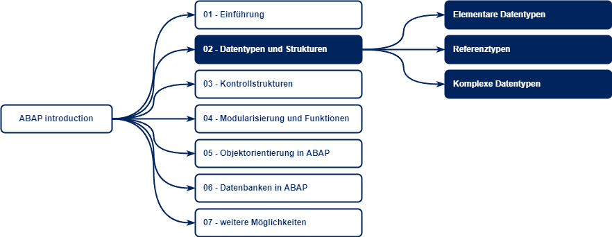

# Datentypen und Strukturen

In SAP ABAP wird unterschieden nach verschiedenen Datentypen, welche sich in folgende Kategorien einordnen lassen:

* Elementare Datentypen (Zahlen, Zeichen, etc.)
* Referenzen (Objektreferenzen)
* Komplexe Datentypen (Stukturen, Tabellen, etc.)

## Elementare Datentypen

Elementare Datentypen sind atomar.

> **Was bedeutet "atomar"?**
>
> Atomar bedeutet in diesem Kontext, dass sich ein Datentyp nicht aus anderen Datentypen zusammensetzten kann.
> Atomare Datentypen definieren sich also selbst.

Es gibt unterschiedliche Ausprägungen von atomaren Datentypen, solche mit fixer Länge und solche mit variabler Länge. Die Länge wird hierbei in Bytes angegeben.

> **Was sind "Bit" und "Byte"?**
>
> Ein *Bit* ist eine Informationseinheit der Informatik, welche die Werte `0` und `1` enthalten kann und ist eine sogenannte *Binärziffer* oder auch *Binärzahl*.
>
> Ein *Byte* ist eine Folge aus 8 Bit. Ein *Byte* wird häufig zur Codierung eines Schriftzeichens genutzt. So nutzt beispielsweise `UTF-8` ein Byte zur Codierung von Schriftzeichen. Es gibt aber auch Schriftzeichen, welche ein zusätzliches Byte benötigen.
>
> Beispiel:
>
> - Buchstabe `y` ist in *UTF-8* binär `01111001`
> - Buchstabe `ä` ist in *UTF-8* binär `11000011 10100100`
> - Zahl `165` ist in binär `10100101`
>
> Siehe auch:
>
> - [Wikipedia - Bit](https://de.wikipedia.org/wiki/Bit)
> - [Wikipedia - Byte](https://de.wikipedia.org/wiki/Byte)
> - [Wikipedia - UTF-8](https://de.wikipedia.org/wiki/UTF-8)

> **Was sind "Binärzahlen"?**
>
> Bei Binärzahlen ist der Stellenwert jeder Ziffer 2-mal so hoch, wie der Stellenwert der nächsten Ziffer rechts.
>
> `128 64 32 16 8 4 2 1`
>
> Hier ergibt sich auch der Grund, warum eine Byte-Zahl (ohne Vorzeichen) nur bis 255 gehen kann:
>
> | Dezimal |    Binär    | 128 | 64 | 32 | 16 | 8 | 4 | 2 | 1 |
> | ------: | :----------: | :-: | :-: | :-: | :-: | :-: | :-: | :-: | :-: |
> |       1 | `00000001` |  -  | - | - | - | - | - | - | X |
> |       6 | `00000110` |  -  | - | - | - | - | X | X | - |
> |     125 | `01111101` |  -  | X | X | X | X | X | - | X |
> |     254 | `11111110` |  X  | X | X | X | X | X | X | - |
>
> Bei Zahlen mit Vorzeichen wird das erste Bit als `+` (`0`) oder `-` (`1`) interpretiert.
> Hierbei bleibt die Anzahl der Zahlen gleich zu der Zahl der Zahlen ohne Vorzeichen. Es ändert sich nur der Wertebereich.

> **Was sind "Hexadezimalzahlen"**
>
> Im Gegensatz zu Dezimalzahlen (Basis 10) haben Hexadezimalzahlen eine Basis von 16. Das bedeutet, dass das Hexadezimalsystem 16 verschiedene Zeichen verwendet.
>
> Da die Zeichen 10, 11, 12, 13, 14 und 15 nicht durch die Zahlen des Dezimalsystems representiert werden können, werden die Zeichen `A`, `B`, `C`, `D`, `E` und `F` verwendet. Erkannbar sind Hexadezimalzahlen an folgender Schreibweise: 7316  oder `0x73` (insbesondere in der Programmierung)
>
> Der Vorteil dieser Schreibweise ist, dass der Wert eines Zeichens 4 Binärziffern entspricht. Das ergibt sich aus der Beziehung der Zahlen 2 und 16 wobei 16 die vierte Potenz der Zahl 2 ist.

Weiterhin lassen sich Datentypen auch nach Art der Daten kategorisieren:

* Numerische Typen
* Zeichenartige Typen
* Byteartige Typen
* Datums- und Zeittypen

Folgende Typen lassen sich definieren:

|     Typ      | Kategorie            | Länge                 | Standard  | Bezeichnung                            | Wertbereich                                                                                                                                                                                                          |        Initialwert        |
| :----------: | -------------------- | --------------------- | --------- | -------------------------------------- | -------------------------------------------------------------------------------------------------------------------------------------------------------------------------------------------------------------------- | :-----------------------: |
|     `b`      | Numerischer Datentyp | 1 Byte                |           | 1-Byte Integer (intern)                | min: 0   max: +255                                                                                                                                                                                        |             0             |
|     `s`      | Numerischer Datentyp | 2 Byte                |           | 2-Byte Integer (intern)                | min: -32.768   max: +32.767                                                                                                                                                                               |             0             |
|     `i`      | Numerischer Datentyp | 4 Byte                |           | 4-Byte Integer                         | min: -2.147.483.648   max: +2.147.483.647                                                                                                                                                                 |             0             |
|    `int8`    | Numerischer Datentyp | 8 Byte                |           | 8-Byte Integer                         | min: -9.223.372.036.854.775.808   max: +9.223.372.036.854.775.807                                                                                                                                         |             0             |
|     `p`      | Numerischer Datentyp | 1 bis 16 Byte         | 8 Byte    | gepackte Zahl                          | [SAP ABAP - Numerische Datentypen](https://help.sap.com/doc/abapdocu_750_index_htm/7.50/de-de/abenbuiltin_types_numeric.htm)                                                                                         |             0             |
| `decfloat16` | Numerischer Datentyp | 8 Byte                |           | dezimale Gleitpunktzahl mit 16 Stellen | negativer Bereich: 10^385 bis -10^-383   0   positiver Bereich: 10^-383 bis 10^385  \* siehe Hinweis zu Subnormalen Zahlen                                                                                |             0             |
| `decfloat34` | Numerischer Datentyp | 16 Byte               |           | dezimale Gleitpunktzahl mit 34 Stellen | negativer Bereich: 10^6145 bis -10^-6143   0   positiver Bereich: 10^-6143 bis 10^6145  \* siehe Hinweis zu Subnormalen Zahlen                                                                            |             0             |
|     `f`      | Numerischer Datentyp | 8 Byte                |           | binäre Gleitpunktzahl mit 17 Stellen   | negativer Bereich: -1,7976931348623157x10^308 bis -2,2250738585072014x10^-308  0   positiver Bereich: +2,2250738585072014x10^-308 bis +1,7976931348623157x10^308  \* siehe Hinweis zu Subnormalen Zahlen |             0             |
|     `c`      | Zeichenartige Typen  | 1 bis 262.143 Zeichen | 1 Zeichen | Textfeld                               | Beliebige alphanumerische Zeichen                                                                                                                                                                                    |    "` `" für jede Stelle     |
|     `n`      | Zeichenartige Typen  | 1 bis 262.143 Zeichen | 1 Zeichen | numerisches Textfeld                   | Beliebige alphanumerische Zeichen, es aber aber die Ziffern 0-9 zulässig                                                                                                                                             |   "`0`" für jede Stelle   |
|   `string`   | Zeichenartige Typen  | variabel              |           | Textstring                             | Beliebige alphanumerische Zeichen                                                                                                                                                                                    | Leerer String der Länge 0 |
|     `x`      | Byteartige Typen     | 1 bis 524.287 Byte    | 1 Byte    | Bytefeld                               | Beliebige Bytewerte, `0x00` bis `0xFF`                                                                                                                                                                               |          `0x00`           |
|  `xstring`   | Byteartige Typen     | variabel              |           | Bytestring                             | Beliebige Bytewerte, `0x00` bis `0xFF`                                                                                                                                                                               | Leerer String der Länge 0 |
| `d` | Datums- und Zeittypen | 8 Zeichen | | Datumsfeld | 8 beliebige alphanumerische Zeichen, gültige Werte sind aber nur Ziffern, welche im Datumsformat `YYYYMMDD` vorliegen. Es gilt `YYYY` (Jahr) muss zwischen `0001` und `9999` sein, `MM` (Monat) muss zwischen `01` und `12` sein, `DD` (Tag) muss zwischen `01` und `31` sein | `00000000` |
| `t` | Datums- und Zeittypen | 6 Zeichen | | Zeitfeld   | 6 beliebige alphanumerische Zeichen, gültige Werte sind aber nur Ziffern, welche im Zeitformat `HHMMSS` vorliegen. Es gilt `HH` (Stunde) muss zwischen `00` und `23` sein, `MM` (Minuten) und `SS` (Sekunden) müssen zwischen `00` und `59` sein | `000000` |

> **Hinweis zu Subnormalen Zahlen**
>
> Zahlen, welche zwischen den Gültigkeitsbereichen (negativer Bereich, positiver Bereich) liegen, bilden den subnormalen Bereich. Diese Zahlen können nicht genau dargestellt werden und werden ggf. gerundet dargestellt. Es werden ggf. Meldungen zum Unterlauf ausgegeben.
>
> Weiterhin kann es zu Rundungsdifferenzen kommen, welche nur durch zweistufige Rundungen umgangen werden können.

> **Hinweis zu zeichenartigen Datentypen**
>
> Datums- und Zeittypen zählen zu zeichenartigen Datentypen, haben aber spezielle Eigenschaften
>
> Die Repräsenetation der Zeichen in Bytes hängt von der gewählten Zeichendarstellung ab.
>
> Auch Strings haben eine maximale Länge (siehe [SAP ABAP - Maximale Datengröße dynamischer Objekte](https://help.sap.com/doc/abapdocu_750_index_htm/7.50/de-de/abenmemory_consumption_2.htm))

Siehe auch:

- [SAP ABAP - Numerische Datentypen](https://help.sap.com/doc/abapdocu_750_index_htm/7.50/de-de/abenbuiltin_types_numeric.htm)
- [SAP ABAP - Maximale Datengröße dynamischer Objekte](https://help.sap.com/doc/abapdocu_750_index_htm/7.50/de-de/abenmemory_consumption_2.htm)
- [IBM - Zahlen](https://www.ibm.com/docs/de/db2/11.1?topic=list-numbers)

## Referenztypen

Referenztypen beschreiben Datenobjekte, welche eine Referenz auf andere Objekte (Datenobjekte, Klasseninstanzen) enthalten.

## Komplexe Datentypen

Komplexe Datentypen setzen sich aus verschiedenen Datentypen zusammen. Mit Ausnahme der Struktur `sy` gibt es keine in SAP ABAP eingebauten komplexen Datentypen. 

Es können unterschieden komplexe Datentypen unterschieden werden:

* strukturierte Datentypen
* Tabellentypen
* Mesh-Typen

### Strukturierte Datentypen

Ein strukturiertert Datentyp ist eine Folge verschiedener [ elemtarer / Referenz- / komplexer ] Datentypen. Sie dient der Zusammenfassung von logisch zusammenhängender Arbeitsbereichen.

### Tabellentypen

Ein Tabellentyp ist eine Folge von beliebig vielen Zeilen des gleichen Datentyps. Tabellentypen werden durch Zeilentypen, Tabellenart und Tabellenschlüssel charakterisiert.

* Zeilentypen können [ elemtarer / Referenz- / komplexer ] Datentypen sein.
* Tabellenart definiert die Art des Zugriffs auf die Tabelle
* Tabellenschlüssel dienen der eindeutigen Identifikation von Tabellenzeilen

### Mesh-Typen

Mesh-Typen sind eine spezielle Form der strukturierten Typen mit tabellarischen Komponenten, zwischen denen Assoziationen (Beziehungen) bestehen.