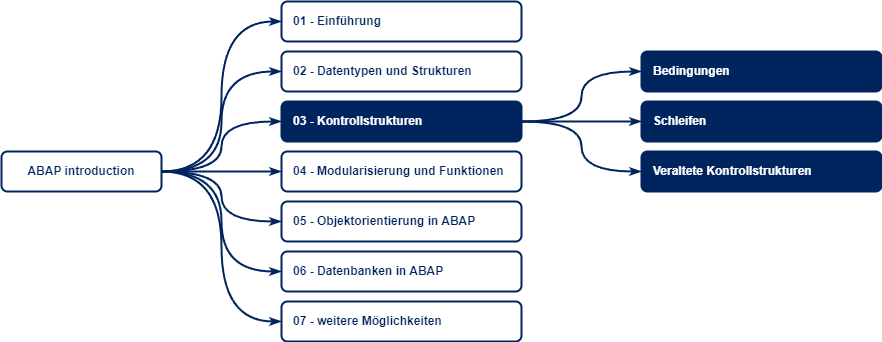

# Kontrollstrukturen



Kontrollstrukturen werden benötigt, um den Programmablauf zu steuern. Der Programmablauf setzt sich hierbei aus vielen verschiedenen kleinen Aufgaben zusammen, welche wiederholt, unter Bedingungen oder alternativ ausgeführt werden müssen.

In SAP ABAP können verschiedene Kontrollstrukturen unterschieden werden:

* Bedingungen
* Schleifen
* Veraltetete Kontrollstrukturen

Werden keine Kontrollstrukturen verwendet, wird jede Anweisung genau einmal sequentiell durchlaufen. 

## Bedingungen

In SAP ABAP gibt es verschiedene Bedingungen und Operatoren, die in einem Vergleich genutzt werden können.

> **Anmerkungen zu Wahrheitswerten**
>
> Wahrweitswerte oder auch *Boolesche Werte* werden je nach Kontext und Sprache unterschiedlich dargestellt.
>
> Generell können folgende Ausdrücke synonym verwendet werden:
>
> `True`: `wahr`, `1`, `w`, `T`, `+`
>
> `False`: `falsch`, `0`, `f`, `F`, "` `", `-`, 

### Vergleichs-Ausdrücke

**Für alle Datentypen**

|  Operator   | Bedeutung      | Ergebnis                                         |
| :---------: | :------------- | :----------------------------------------------- |
| `EQ` / `=`  | gleich         | `True` wenn beide Werte gleich sind              |
| `NE` / `<>` | ungleich       | `True` wenn beide Werte nicht gleich sind        |
| `LT` / `<`  | kleiner als    | `True` wenn `wert_1` kleiner als `wert_2` ist    |
| `GT` / `>`  | größer als     | `True` wenn `wert_1` größer als `wert_2` ist     |
| `LE` / `<=` | kleiner gleich | `True` wenn `wert_1` kleiner gleich `wert_2` ist |
| `GE` / `>=` | größer gleich  | `True` wenn `wert_1` größer gleich `wert_2` ist  |

**Zeichenartige Datentypen**

| Operator | Bedeutung           | Ergebnis                                                         | Case-Sensitive |
| :------: | :------------------ | :--------------------------------------------------------------- | :------------: |
|   `CO`   | contains only       | `True` wenn `wert_1` nur Zeichen aus `wert_2` enthält            |       ja       |
|   `CN`   | contains not only   | `True` wenn `wert_1` nicht nur Zeichen aus `wert_2` enthält      |       ja       |
|   `CA`   | contains any        | `True` wenn `wert_1` mindenstes ein Zeichen aus `wert_2` enthält |       ja       |
|   `NA`   | contains not any    | `True` wenn `wert_1` kein Zeichen aus `wert_2` enthält           |       ja       |
|   `CS`   | contains string     | `True` wenn `wert_1` `wert_2` beinhaltet                         |      nein      |
|   `NS`   | constains no string | `True` wenn `wert_1` `wert_2` nicht beinhaltet                   |      nein      |
|   `CP`   | contains pattern    | `True` wenn das Muster von `wert_1` zu `wert_2` passt            |      nein      |
|   `NP`   | no pattern          | `True` wenn das Muster von `wert_1` nicht zu `wert_2` passt      |      nein      |

**Weitere Vergleichsoperatoren**

Der ternäre Vergleichsoperator `[NOT] BETWEEN` prüft eine Intervallzugehörigkeit. 

```abap
DATA(wert_1) = 10.

" Prüfung ob WERT_1 zwischen 5 und 15 ist
... wert_1 BETWEEN 5 AND 15
```

Der Ausdruck kann auch mithilfe von 2 binären Oparatoren formuliert werden. Dieser Ausdruck ist aber weniger gut lesbar.

```abap
DATA(wert_1) = 10.

" Prüfung ob WERT_1 zwischen 5 und 15 ist
... wert_1 GE 5 AND wert_1 LE 15
```

Der tabellarische Vergleichsoperator `[NOT] IN` prüft die Zugehörigkeit eines Wertes zu einer Tabelle. Die Tabelle muss hierbei folgenden Aufbau haben:

```
SIGN        " I = Include; E = Exclude
OPTION      " Vergleichsoperator, z.B.: EQ oder NE
LOW         " Wert Untergrenze oder Einzelwert
HIGH        " Wert Obergrenze
```

Dieser Aufbau wird nur von Ranges, Selektionstabellen oder internen Tabellen mit genannten Aufbau erfüllt.

```abap
DATA(wert_1)  = 'text_2'.
DATA(tabelle) = VALUE #( sign   =   'I'
                         option = 'EQ'
                         ( low  = 'text_1' )
                         ( low  = 'text_2' )
                         ( low  = 'text_3' ) ).

" Prüfung ob WERT_1 in TABELLE enthalten ist
... wert_1 IN tabelle
```

### Prädikats-Ausdrücke

Prädikatsausdrücke überprüfen einen Wert auf seinen Zustand und bestimmen einen Wahrheitswert. Sie werden mit dem Operator `IS` eingeleitet.

Folgende Prädikatsausdrücke sind verfügbar:

* `IS [NOT] INTIIAL`
* `IS [NOT] BOUND`
* `IS [NOT] INSTANCE OF`
* `IS [NOT] ASSIGNED`
* `IS [NOT] SUPPLIED`
* `IS [NOT] REQUESTED` (obsolet)

Der Ausdruck `IS [NOT] REQUESTED` ist obsolet und wird durch `IS [NOT] SUPPLIED` ersetzt. Er ist nur der Vollständigkeit halber aufgeführt.

Der Ausdruck `IS [NOT] INTIIAL` überprüft, ob ein Wert initial ist. Basierend auf den Typ-Spezifischen Initialwerten (siehe [Datentypen](02-datatypes.md)) wird die Prüfung durchgeführt.

**Beispiel**
```abap
DATA(wert_1) = 0.
... wert_1 IS INITIAL
```

Der Ausdruck `IS [NOT] BOUND` überprüft, ob eine Referenzvariable eine gültige Referenz enthält. Zulässig für diesen Operator sind nur Referenzvariablen. Eine gültige Referenz ist gegeben, wenn

* sie dereferenziert werden kann
* sie auf ein Objekt zeigt

**Beispiel**
```abap
DATA(wert_1) = 'text'.
DATA(ref_1) = REF #( wert_1 )

... ref_1 IS BOUND
```

Der Ausdruck `IS [NOT] INSTANCE OF` überprüft, ob eine Objektreferenz den gleichen Typ hat wie der Vergleichstyp. Hierbei muss der Vergleichstyp entweder eine Klasse oder ein Interface sein. 

**Beispiel**
```abap
DATA: wert_1 TYPE REF TO class

" instanziieren einer Klasse
wert_1 = NEW class( ).

" Prüfung
... wert_1 IS INSTANCE OF class
```

Der Ausdruck `IS [NOT] ASSIGNED` prüft, ob ein Feld-Symbol einem Speicherbereich zugewiesen ist.

**Beispiel**
```abap
DATA(wert_1) = 'text'.
ASSIGN wert_1 TO FIELD-SYMBOL(<fs>).

... <fs> IS ASSIGNED.
```

Der Ausdruck `IS [NOT] SUPPLIED` prüft, ob ein Parameter in einem Funktions- oder Methodenaufruf versorgt/angefordert wird.

**Beispiel**
```abap
" Methoden-Definition
METHODS test IMPORTING param_1 TYPE i 
                       param_2 TYPE i.

" Methoden-Implementierung
METHOD test.

    ... param_1 IS SUPPLIED
    ... param_2 IS SUPPLIED

ENDMETHOD.

" Methoden-Aufruf
test( param_1 = 10 ).
```

### Prädikat-Funktionen

Prädikatfunktionen sind eingebaute Funktionen, welche einen Wahrheitswert zurückliefern. Es wird unterschieden zwischen 

* [Funktionen für zeichenartige Argumente](https://help.sap.com/doc/abapdocu_751_index_htm/7.51/de-de/abenpredicate_functions_strgs.htm)
* [Funktionen für tabellenartige Argumente](https://help.sap.com/doc/abapdocu_751_index_htm/7.51/de-de/abenpredicate_functions_tabs.htm)

**Beispiel**
```abap
DATA(wert_1) = 'text_1'.

" Aufruf einer Prädikatfunktion
... contains( val = wert_1 sub = 'x' )
```

Die Funktionen sind unter den angegebenen Links aufgelistet und beschrieben.

### Prädikative Methoden

Es ist auch möglich, eigens definierte Methoden in einem logischen Ausdruck zu verwenden. 

Das Ergebnis des Methodenaufrufs ist

* `True` wenn das Ergebnis nicht initial ist
* `False` wenn das Ergebnis initial ist 

Hierbei ist der Datentyp des Ergebnis nicht relevant, da auf den Datentyp-gerechten Initialwert geprüft wird.

Hieraus ergibt sich, dass der prädikative Methodenaufruf eine Kurzform für 
```abap
... methode( ) IS NOT INITIAL
```
ist.

Insbesondere für Methoden, welche als Ergebnis eine Boolesche Variable haben ist diese Form gut geeignet.

**Beispiel**
```abap
... cl_demo_sap_gui=>check( ).
```

### Boolesche Operatoren

Boolesche Operatoren erlauben es, verschiedene Bedingungen/logische Ausdrücke zu verknüpfen. Es sind folgende Operatoren möglich:

* `AND`
* `OR`

Diese werden mit folgender Syntax angewendet: 

```abap
... bedingung_1 [OR, AND] bedingung_2
```

**Erklärung:**

Die logische Ausdruck `bedingung_1` und `bedingung_2` werden logisch miteinander verknüpft. Hierbei kann der boolesche Operator `AND` oder `OR` angewendet werden.

`bedingung_1` und `bedingung_2` stehen hierbei für unterschiedliche Vergleiche.

Anhand der nachfolgenden Wahrheitstabelle kann das Ergebnis der Verknüpfung ermittelt werden.

| `bedingung_1` | `bedingung_2` |  `OR`   |  `AND`  |
| :-----------: | :-----------: | :-----: | :-----: |
|    `False`    |    `False`    | `False` | `False` |
|    `False`    |    `True`     | `True`  | `False` |
|    `True`     |    `False`    | `True`  | `False` |
|    `True`     |    `True`     | `True`  | `True`  |

Siehe auch: [Wikipedia - Wahrheitstabelle](https://de.wikipedia.org/wiki/Wahrheitstabelle)
                    
Mithilfe des Ausdrucks `EQUIV` können 2 logische Ausdrücke mitander verknüpft werden.

```abap
... bedingung_1 EQUIV bedingung_2
```

Der verknüpfte Ausdruck ergibt einen neuen logischen Ausdruck, der wahr ist, wenn

* beide Ausdrucke wahr sind
* beide Ausdrücke falsch sind

Eine solche Verknüpfung wird auch Equivalenz-Verknüpfung genannt. Sie ist gleich zu `XNOR`. Wird `EQUIV` mit `NOT` negiert, erhält man den Ausdruck `XOR`.

| `bedingung_1` | `bedingung_2` | `XNOR`<br/>`EQUIV` | `XOR`<br/>`NOT EQUIV` |
| :-----------: | :-----------: | :----------------: | :-------------------: |
|    `False`    |    `False`    |       `TRUE`       |        `FALSE`        |
|    `False`    |    `True`     |      `FALSE`       |        `TRUE`         |
|    `True`     |    `False`    |      `FALSE`       |        `TRUE`         |
|    `True`     |    `True`     |       `TRUE`       |        `FALSE`        |

Der logische Ausdruck `NOT` negiert den Wahrheitswert einer logischen Bedingung.

```abap
... NOT logischer_ausdruck
```

So wird aus:

* `True` &rarr; `False`
* `False` &rarr; `True`

Er kehrt also den Wahrheitswert um.

**Wichtiger Hinweis:**

Der Ausdruck `NOT` ist nicht mit dem Ausdruck `NOT` in den Vergleichsoperatoren `NOT IN`, `IS NOT`, ... zu verwechseln.

Es ist beispielsweise möglich, eine solche Bedingung zu schreiben:

```abap
... NOT ( wert_1 NOT IN liste_1 )
```

### Klammerungen

Um verschiedene Bedingungen logisch miteinander zu verknüpfen, ist es möglich, Klammern `( )` einzusetzen.

Hierbei stellt ein geklammerter Ausdruck selbst einen logischen Ausdruck dar.

**Beispiel:**

```abap
... ( bedingung_1 AND bedingung_2 ) OR
    ( bedingung_3 AND bedingung_4 )
```

**Erklärung**

Wenn entweder `bedingung_1` und `bedingung_2` wahr sind oder `bedingung_3` und `bedingung_4` wahr sind, so ist dieser Ausdruck wahr.

Gelesen werden kann es wie folgt:
```abap
klammer_1 = ( bedingung_1 AND bedingung_2 )
klammer_2 = ( bedingung_3 AND bedingung_4 )

" logische Bedingung ergibt
... klammer_1 OR klammer_2
```

Mithilfe von Klammern ist es möglich, geschachtelte Bedingungen zu erstellen. Dies kann notwendig sein, wenn eine Anweisung unter verschiedenen (komplexen) Bedinungen nur einmalig durchlaufen werden soll.

### IF
Die einfachste Bedingung ist die sogenannte `IF`-Bedingung. 

Eingeleitet wird die Bedindung durch `IF`. Abgeschlossen wird die Bedingung durch `ENDIF`.

Die Syntax für die IF-Bedingung ist Folgende:

```abap
DATA(wert_1) = 100.
DATA(wert_2) = 120.

" IF-Bedingung
IF wert_1 LT wert_2.
    " execute something
ENDIF.
```

**Erklärung**

Es wurden 2 Variablen definiert:

* `wert_1` mit einem Zahlenwert von 100
* `wert_2` mit einem Zahlenwert von 120

Mit der `IF`-Bedingung wurde geprüft, ob der Wert der Variable `wert_1` kleiner ist als der Wert der Variable `wert_2`. Hierzu wurde der Operator `LT` (kleiner als) gewählt.

In diesem Fall wird die Anweisung in dem Block durchlaufen.

**Alternative Schreibweise**

Mit ABAP 7.40 wurde eine weitere Schreibweise eingeführt. Diese Schreibweise hat ein von der Bedingung abhängiges Resultat. Diese Schreibweise ist nur zulässig, wenn eine Wert-Zuweisung stattfindet.

```abap
DATA(wert_1) = 100.
DATA(wert_2) = 120.

" zulässig
DATA(wert_x) = COND #( WHEN wert_1 LT wert_2 THEN 'kleiner' ).

" nicht zulässig
COND #( WHEN wert_1 LT wert_2 THEN anweisung ).
```

### IF-ELSE

Eine weitere Form der `IF`-Bedingung ist die `IF-ELSE`-Bedindung. Hierbei wird eine Anweisung ausgeführt, wenn die Bedingung fehl schlägt. 

Genutzt werden kann `IF-ELSE` wenn eine Fallunterscheidung je nach Ergebnis der Bedingung durchgeführt werden soll.

```abap
DATA(wert_1) = 100.
DATA(wert_2) = 120.

" IF-ELSE-Bedingung
IF wert_1 EQ wert_2.
    " Anweisung 1
ELSE.
    " Anweisung 2
ENDIF.
```

**Erklärung**

Nach der Definition beider Variablen wird geprüft, ob beide Werte gleich sind.

Sind beide Werte gleich, wird der Block `Anweisung 1` ausgeführt. Im anderen Fall (beide Werte sind nicht gleich) wird der Block `Anweisung 2` ausgeführt.

**Alternative Schreibweise**

Mit ABAP 7.40 wurde eine weitere Schreibweise eingeführt. Diese Schreibweise hat ein von der Bedingung abhängiges Resultat. Diese Schreibweise ist nur zulässig, wenn eine Wert-Zuweisung stattfindet.

```abap
DATA(wert_1) = 100.
DATA(wert_2) = 120.

" zulässig
DATA(wert_x) = COND #( WHEN wert_1 EQ wert_2 THEN 'gleich' ELSE 'ungleich' ).

" nicht zulässig
COND #( WHEN wert_1 EQ wert_2 THEN anweisung_1 ELSE anweisung_2 ).
```

### IF-ELSEIF-ELSE

Eine weitere Form des `IF`-Ausdrucks ist der `IF-ELSEIF-ELSE`-Ausdruck. Hierbei werden verschiedene Bedingungen sequentiell geprüft, bis die erste Bedingung als Ergebnis `True` hat. Falls keine der Prüfungen erfolgreich ist, wird die Anweisung unter `ELSE` durchgeführt. Es wird **nur** eine Anweisung ausgeführt.

```abap
DATA(wert_1) = 150.
DATA(wert_2) = 120.
DATA(wert_3) = 130.
DATA(wert_4) = 150.

" IF-ELSE-Bedingung
IF wert_1 EQ wert_2.
    " Anweisung 1
ELSEIF wert_1 EQ wert_3.
    " Anweisung 2
ELSEIF wert_1 EQ wert_4.
    " Anweisung 3
ELSE.
    " Anweisung 4
ENDIF.
```

**Erklärung**

Es sind 4 Variablen definiert. Im obigen Beispiel wird geprüft, ob Variable `wert_1` gleich zu einer der anderen Variablen ist. 

Die Prüfung erfolgt nach folgender Reihenfolge:

1. Ist `wert_1` gleich `wert_2` &rarr; das Ergebnis ist `false`
2. Ist `wert_1` gleich `wert_3` &rarr; das Ergebnis ist `false`
3. Ist `wert_1` gleich `wert_4` &rarr; das Ergebnis ist `true`
4. `Anweisung 3` wird ausgeführt
5. Der Code wird nach `ENDIF` fortgesetzt

**Alternative Schreibweise**

Mit ABAP 7.40 wurde eine weitere Schreibweise eingeführt. Diese Schreibweise hat ein von der Bedingung abhängiges Resultat. Diese Schreibweise ist nur zulässig, wenn eine Wert-Zuweisung stattfindet.

```abap
DATA(wert_1) = 150.
DATA(wert_2) = 120.
DATA(wert_3) = 130.
DATA(wert_4) = 150.

" zulässig
DATA(wert_x) = COND #( WHEN wert_1 EQ wert_2 THEN 'gleich 120'
                       WHEN wert_1 EQ wert_3 THEN 'gleich 130'
                       WHEN wert_1 EQ wert_4 THEN 'gleich 150'
                       ELSE 'ungleich' ).

" nicht zulässig
COND #( WHEN wert_1 EQ wert_2 THEN anweisung_1
        WHEN wert_1 EQ wert_2 THEN anweisung_2
        WHEN wert_1 EQ wert_2 THEN anweisung_3
        ELSE anweisung_4 ).
```

### CASE

Eine Fallunterscheidung kann durch den Ausdruck `CASE` erfolgen. Hierbei wird geprüft, ob eine Variable einen bestimmten Wert hat. Eine Bedingung wird hierzu mit `WHEN` eingeführt.

Es wird jede Bedingung einzeln nachfolgend geprüft. Schlagen alle Prüfungen fehl, kann eine Anweisung in dem `WHEN OTHERS` definiert werden.

```abap
DATA(wert_1) = 130.

" Fallunterscheidung
CASE wert_1.

    WHEN 100.
        " Anweisung 1

    WHEN 130.
        " Anweisung 2

    WHEN 150.
        " Anweisung 3

    [WHEN OTHERS].      " optional
        " Anweisung 4

ENDCASE.
```

**Erklärung**

Der Variable `wert_1` wurde der Wert 130 zugewiesen. In der nachfolgenden Fallunterscheidung wird geprüft

1. ob der Wert gleich 100 ist
2. ob der Wert gleich 130 ist

Da die Bedingung mit `WHEN 130` erfüllt ist, wird die `Anweisung 2` ausgeführt. Danach werden die Prüfungen beendet und der Code wird nach `ENDCASE` fortgesetzt.

Die Prüfung `WHEN OTHERS` wird aufgerufen, wenn keine der vorherigen Bedingungen erfüllt ist.

> **Hinweise zur Performance**
>
> Obiges Beispiel kann auch als `IF-ELSEIF-ELSE` realisiert werden:
>
> ```abap
> DATA(wert_1) = 130.
> 
> IF wert_1 EQ 100.
>   " Anweisung 1
> ELSEIF wert_1 EQ 130.
>   " Anweisung 2
> ELSEIF wert_1 EQ 150.
>   " Anweisung 3
> ELSE.
>   " Anweisung 4
> ENDIF.
> ```
>
> Eine `CASE`-Struktur ist etwas schneller als eine gleichwertige `IF-ELSEIF-ELSE` Struktur.
> Es sollte jedoch immer eine geeignete Schreibweise verwendet werden, welche gut verständlich und leserlich ist.

**Alternative Schreibweise**

Mit ABAP 7.40 wurde eine weitere Schreibweise eingeführt. Diese Schreibweise hat ein von der Bedingung abhängiges Resultat. Diese Schreibweise ist nur zulässig, wenn eine Wert-Zuweisung stattfindet.

```abap
DATA(wert_1) = 130.

" zulässig
DATA(wert_x) = SWITCH #( wert_1
                         WHEN 100 THEN 'gleich 120'
                         WHEN 130 THEN 'gleich 130'
                         WHEN 150 THEN 'gleich 150'
                         ELSE 'ungleich' ).

" nicht zulässig
SWITCH #( wert_1
          WHEN 100 THEN anweisung_1
          WHEN 130 THEN anweisung_2
          WHEN 150 THEN anweisung_3
          ELSE anweisung_4 ).
```

## Schleifen

Es ist teilweise notwendig, Anweisungen wiederholt auszuführen. Dies ist mit Schleifen möglich.

> **Hinweis zur Bezeichnung**
>
> Im Kontekt von Schleifen wird auch oft von *Iterationen* gesprochen. 
>
> Eine *Iteration* bezeichnet das wiederholte Ausführen einer Aktion. Im Kontext der Informationstechnik bezeichnet eine *Iteration* auch einen Schleifendurchgang.

### DO

Eine `DO`-Schleife ist eine unbedingte Schleife, die den Anweisungsblock enthält. 

Es ist möglich, bei Einleitung der Schleife die Anzahl der Durchläufe anzugeben. Ist die Anzahl der Durchläufe angegeben, so ist es nicht notwendig, eine explizite Anweisung zum Verlassen der Schleife anzugeben. 

> **Warnung**
>
> Eine `DO`-Schleife ohne Angabe einer Wiederholungsanzahl und ohne Angabe einer Anweisung zum Verlassen der Schleife ist eine sogenannte *Endlosschleife*.
>
> *Endlosschleifen* haben somit keine Anweisung zur Beendigung der Schleife und laufen ewig.
>
> In SAP ABAP gibt es einen Parameter, der die Laufzeit eines Programms begrenzt und nach Erreichen beendet.

```abap
" Beispiel DO mit Anweisung zum Verlassen
DO.

    ...

    " IF-Bedingung zum Prüfen
    IF ...
        EXIT.
    ENDIF.

ENDDO.

" Beispiel DO mit Anzahl an Wiederholungen
DO 10 TIMES.
    ...
ENDDO.
```

**Erfahrung**

Mit `DO`-Schleifen lassen sich sehr einfach Schleifen aufbauen. Es ist allerdings meistens hilfreicher, eine `LOOP`-Schleife zu verwenden.

### WHILE

Eine `WHILE`-Schleife ist eine bedingte Schleife, die solange wiederholt wird, wie die zu Prüfende Bedingung wahr (`True`) ist. Bei der Bedingung handelt es sich um einen beliebigen logischen Ausdruck, welcher hinter der der Anweisung `WHILE` angegeben wird.

Die Schleife wird solange ausgeführt, während der logische Ausdruck wahr ist oder die Schleife mit `EXIT` verlassen wird. Je nach Gestaltung des Anweisungsblockes und des logischen Ausdrucks kann auch hier eine *Endlosschleife* auftreten.

```abap
DATA(bedingung) = abap_true.

WHILE bedingung EQ abap_true.

    " Anweisung zum füllen der Tabelle tabelle
    APPEND INITIAL LINE TO tabelle.

    " beenden der Schleife
    IF lines( tabelle ) GE 100.
        bedingung = abap_false.
    ENDIF.

ENDWHILE.
```

**Erfahrung**

Mit `WHILE`-Schleifen lassen sich sehr einfach Schleifen aufbauen. Es ist allerdings meistens hilfreicher, eine `LOOP`-Schleife zu verwenden.

### LOOP

Bei der `LOOP`-Schleife handelt es sich um eine spezielle Form der Schleifen. Die Schleife basiert auf einer Tabelle und wird für jede Zeile der Tabelle einmal ausgeführt.

Der Inhalt der Tabelle kann hierbei entweder in eine Variable oder ein Feldsymbol gelesen werden und ist somit während des Schleifendurchlaufs verfügbar. 

Mithilfe von logischen Bedingungen kann die Anzahl der Schleifen reduziert werden. Nur Zeilen, welche die Bedingungen erfüllen, werden auch in der Schleife durchlaufen.

```abap
DATA(tabelle) = VALUE #( ( zahl = 1 ) 
                         ( zahl = 2 ) 
                         ( zahl = 3 ) 
                         ( zahl = 4 ) ).

" Schleife
LOOP AT tabelle ASSIGNING FIELD-SYMBOL(<zeile>) WHERE zahl GE 3.
    " Anweisung
ENDLOOP.
```

**Erfahrung**

`LOOP`-Schleifen sind ein sehr häufig genutztes Mittel, um Daten einer Tabelle zu lesen, verarbeiten oder ändern. Grund hierfür sind Daten, welche zu einem großen Teil tabellarisch vorliegen.

Mögliche Anwendungsfälle von `LOOP`-Schleifen umfassen beispielsweise das Zusammenfassen von mehreren Zeilen in eine oder das Erstellen neuer Tabellen basierend auf Daten der aktuellen Tabelle.

### Alternative Schreibweise

Mit ABAP 7.40 wurden eine weitere Schreibweise eingeführt, um tabellarische Daten Schleifenweise zu bearbeiten: `FOR`

Hierbei handelt es sich um  eine Schleife, welche nur während eines Konstruktorenausdrucks (`NEW`, `VALUE`) oder Reduktionsausdrucks (`REDUCE`) aufgerufen werden kann.

Mit dem Zusatz `FOR ... IN ...` wird eine Tabelleniteration durchgeführt und kann somit ein `LOOP` ersetzten. 

Mit dem Ausdruck `FOR ... WHILE ...` oder `FOR ... IN ...` wird eine bedingte Iteration ausgeführt, welche alternativ zu `DO` oder `WHILE` sind.

```abap
DATA(zahl) = 0.

" WHILE - alte Schreibweise
WHILE zahl LE 10.
    zahl = zahl + 1.
ENDWHILE.
```

```abap
DATA(zahl) = 0.

" FOR - neue Schreibweise
zahl = REDUCE #( INIT z = 0
                 FOR i = 1 WHILE i GE 10
                 NEXT z = z + 1 ).
```

**Hinweise zur neuen Schreibweise**

Der Nachteil dieser Schreibweise ist, dass diese unter Umständen schwieriger zu lesen ist. Insbesondere mit verschachtelten Anweisungen kann es sehr schwer sein, den Code zu verstehen. In diesem Fall ist die Verständlichkeit vorzuziehen.

Ein Unterschied zur alten Schreibweise ist, dass diese nicht zu 100% gleich funktioneren muss. So können je nach Schreibweise unterschiedliche Ergebnisse rauskommen. In diesem Fall muss die Ergebnisermittlung genau geprüft werden und ggf. angepasst werden.