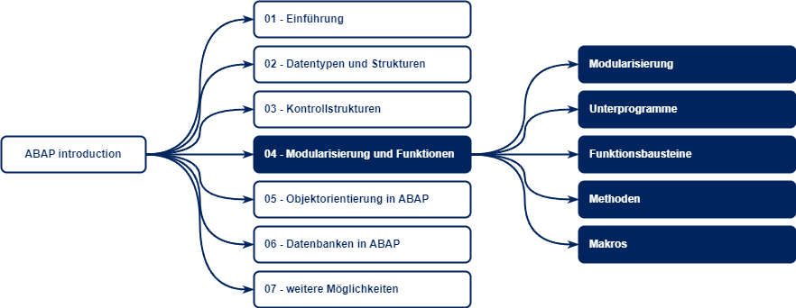

# Modularisierung und Funktionen



Während ein Programm geschrieben wird, fällt es häufig auf, dass eine bestimmte Anweisung (oder eine Kette von Anweisungen) wiederholt auf verschiedene Daten oder zu verschiedenen Zeitpunkten angewendet werden muss.

Zusätzlich versuchen wir, verschiedene Anweisungen thematisch zusammenzufassen um die Lesbarkeit und Verständlichbarkeit des Codes zu erhöhen.

Diese Vorgehensweise wird Modularisierung genannt. 

> **Wichtige Anmerkung**
>
> Die Modularisierung erfolgt im Kopf, nicht im Quellcode. Eine gute Modularisierung und Strukturierung des Codes wird im Kopf erstellt. Der Quellcode bildet diese nur ab.
>
> &rarr; Frei nach dem Motto: "Shit in - Shit out"

Als generelles Beispiel soll hier ein gedanklicher Quelltext des Programmes `Z_BEISPIEL` dienen, dass mehrere Tausend Zeilen Code enthält. 

## Globaler und Lokaler Scope

Bei globalen Variablen handelt es sich um Variablen, welche dem gesamten Programm an jeder Stelle (alle Ebenen) zur Verfügung stehen. Diese werden außerhalb von Unterprogrammen/Klassen definiert im Rahmenprogramm definiert.

Bei lokalen Variablen handelt es sich um Variablen, welche nur im Unterprogramm selbst zur Verfügung stehen (auf gleicher Ebene) und nicht außerhalb des Unterprogramms (auf darüber/darunter liegenden Ebenen ). 

```abap
REPORT z_beispiel.

DATA(globale_variable) = 10.

" Aufruf Unterprogramm
PERFORM addieren USING 25.

FORM addieren
    USING zahl TYPE i.
    
    " Zugriff auf globale Variable -> zulässig
    globale_variable = globale_variable + 10.

ENDFORM.
```

```abap
REPORT z_beispiel.

" Aufrufen Unterprogramm
PERFORM wurzel_ziehen USING 25.

FORM wurzel_ziehen
    USING zahl TYPE i.

    " Definition lokale Variable
    DATA(wurzel) = sqrt( zahl ).
    
    " Ausgabe lokale Variable -> zulässig
    WRITE wurzel.

ENDFORM.

" Ausgabe Variable -> unzulässig
WRITE wurzel.
```

Wie an obigem Beispiel erkennbar ist, ist die Variable `globale_variable` auch im Unterprogramm verfügbar, obwohl diese nicht als Parameter übergeben wurde.

Im Unterschied hierzu existiert die Variable `wurzel` nur in dem Unterprogramm `wurzel_ziehen`. Der versuchte Zugriff außerhalb des Unterprogramms ist nicht zulässig und führt zu einem Fehler.

> **Wichtiger Hinweis:**
>
> Es sollten möglichst keine globalen Variablen genutzt werden, da bei globalen Variablen das Problem des Zugriffs besteht. Jedes Unterprogramm kann unabhängig auf diese Variable zugreifen und den Wert der Variablen ändern.
>
> Stattdessen sollte mit lokalen Variablen gearbeitet werden.
>
> Ist es nicht möglich, auf globale Variablen zu verzichten, so ist es empfehlenswert, auf diese über einen Übergabeparameter zuzugreifen und nicht direkt. 

## Modularisierung

Die Modularisierung teilt einen Quellcode in mehrere seperate Quellcodes (bzw. Dateien) auf. Diese separaten Quelltexte können von unterschiedlichen Entwicklern gepflegt werden. Diese einzelnen Quellcodes bzw. Dateien werden Includes genannt und unterscheiden sich von einem Programm darin, dass sie nicht durch die `REPORT`-Anweisung eingeleitet werden. 

Häufig wird die Modularisierung verwendet um folgende Codes-Abschnitte voneinander zu trennen:

* **Definitionen**: Hier werden Typisierungen und Konstanten gepflegt, beispielsweise im Include `Z_BEISPIEL_DEF`
* **Selektionsbildschirm**: Hier wird der Selektionsbildschirm erstellt, beispielsweise im Include `Z_BEISPIEL_SCR`
* **Unterprogramme**: Hier werden alle Unterprogramme erstellt und gepflegt, beispielsweise im Include `Z_BEISPIEL_PER`
* **Methoden**: Hier werden alle Methoden zusammengefasst. Da Methoden teil einer (lokalen) Klasse sind, werden hier häufig die Definition und Implementierung der Klasse voneinander getrennt, beispielsweise in `Z_BEISPIEL_CLD` (Definition) und `Z_BEISPIEL_CLI` (Implementierung)
* **Module**: Hier werden alle Module zusammengefasst, welche im Rahmen der Dynpro-Programmierung genutzt werden. Diese werden unterschieden nach Before-Output-Module und After-Input-Module, weswegen diese auch häufig voneinander getrennt werden in beispielsweise `Z_BEISPIEL_PBO` (Before-Output) und `Z_BEISPIEL_PAI` (After-Input)

Beispiel:

```abap
REPORT z_beispiel.

INCLUDE: z_beispiel_def,
         z_beispiel_scr,
         z_beispiel_per.
```

> **Wichtiger Hinweis zu Includes:**
>
> Theoretisch ist es möglich, ein Include in mehreren Programmen einzubinden:
> 
> ```abap
> REPORT z_beispiel_1.
>   INCLUDE: z_beispiel_include.
> ```
> ```abap
> REPORT z_beispiel_2.
>   INCLUDE: z_beispiel_include.
> ```
>
> Von dieser Möglichkeit sollte allerdings abgesehen werden, da dies die Wartbarkeit von Code extrem schwierig macht. 
>
> Wenn Code in mehreren Programmen genutzt werden soll, soll besser auf *Funktionsbausteine* oder *Globale Klassen* zurückgegriffen werden.

Eine Include-Anweisung hat den gleichen Effekt, als wenn mann den Code des Includes an der gleichen Stelle einsetzen würde. Dies bedeutet auch, dass die Reihenfolge der Includes zu beachten ist, wenn man beispielsweise obige Trennung verwendet.

## Unterprogramme

Unterprogramme dienen dazu, verschiedene Aufgaben logisch zusammenzufassen und bereitzustellen. Die implementierten Unterprogramme können an verschiedenen Stellen im Code auch mehrfach aufgerufen werden.

Im Unterschied zu Includes haben die Unterprogramme eine definierte Schnittstelle. Die Schnittstelle definiert, welche Parameter das Unterprogramm benötigt und veröffentlicht. 

Unterprogramme werden mit einem öffnenden Operator `FORM` eingeleitet und mit dem schließendend Operator `ENDFORM` abgeschlossen. Alles, was zwischen beiden Operatoren steht, ist teil des Unterprogramms. Aufgerufen werden können Unterprogramme mithilfe des Operators `PERFORM`.

Mit dem Operator `USING` kann angegeben werden, welche Parameter die Schnittstelle nutzen, aber nicht verändern darf. Parameter, welche unter `USING` definiert sind, sind schreibgeschützt. Mit dem Parameter `CHANGING` können änderbare Parameter angegeben werden. Es findet eine Wertübergabe statt.

Sind mehrere Parameter in einem Operator angegeben (bsp. 3 `USING`-Parameter), muss die Reihenfolge dieser Parameter beim Aufruf eingehalten werden. Auch ist es notwendig, alle 3 Parameter auszufüllen.

```abap
DATA: tabelle TYPE ty_t_beispiel_struktur.

FORM tabelle_füllen
    CHANGING ct_tabelle TYPE ty_t_beispiel_struktur.

    " füllen der Tabelle
    ct_tabelle = VALUE #( ( vorname = 'Max'   nachname = 'Mustermann' geburtstag = '19900101' abteilung = 'Vertrieb' )
                          ( vorname = 'Anna'  nachname = 'Schmidt'    geburtstag = '19850515' abteilung = 'Marketing' )
                          ( vorname = 'Peter' nachname = 'Meier'      geburtstag = '19751130' abteilung = 'IT' )
                          ( vorname = 'Sarah' nachname = 'Müller'     geburtstag = '19950822' abteilung = 'Personalwesen' ) ).

ENDFORM.

" Aufruf des Unterprogramms
PERFORM tabelle_füllen 
    CHANGING tabelle.
```

> **Wichtiger Hinweis:**
>
> Technisch gesehen ist es zwar möglich, Unterprogramme von fremden Programmen aufzurufen. Von dieser Möglichkeit sollte allerdings abgesehen werden, da dies zu Problemen führen kann.

## Funktionsbausteine

Funktionsbausteine sind ähnlich wie Unterprogramme, unterschieden sich allerdings erheblich in Ihrer Art und Weise. Gepflegt werden Funktionsbausteine in der Transaktion `SE37`.

Vorgesehen sind Funktionsbausteine für Aufgaben, welche an verschiedenen Stellen im SAP-System benötigt werden. Beispielsweise wird die Aufgabe *E-Mails versenden* an verschiedenen Stellen im System benötigt, wie beispielsweise:

* Versenden von Auftragsbestätigungen
* Versenden von Bestellungen
* Versenden von Erinnerungen
* Versenden von System-Status-Informationen

Das SAP-System liefert bereits eine ganze Menge fertiger Funktionsbausteine mit, welche genutzt werden können. Es sind aber nicht alle für die Nutzung durch Kunden vorgesehen. Zusätzlich können eigene Funktionsbausteine entwickelt werden. Diese beginnen alle mit `Y` oder `Z`.

Bei Funktiosnbausteinen sind die Parameter in verschiedene Registerkarten unterteilt:

* Import
* Export
* Changing
* Tabellen
* Ausnahmen

`IMPORT`-Parameter sind Parameter, welche bei Funktionsbaustein-Aufruf an den Funktionsbaustein übergeben werden. Hier sind verschiedene Optionen möglich:

* *Optional*: Wenn der Haken *Optional* gesetzt ist, muss der Parameter nicht zwingend beim Aufruf angegeben werden. Ist er nicht gesetzt, so ist der Parameter obligatorisch.
* *Wertübergabe*: Dieses Kennzeichen steuert, ob eine Wertreferenz oder eine Kopie des Wertes an den Funktionsbaustein übergeben wird. Ist das Kennzeichen gesetzt, so wird eine Kopie des Wertes erzeugt und an den Funktionsbaustein übergeben. Der Funktionsbaustein kann den kopierten Wert dann beliebig bearbeiten. Ist das Kennzeichen nicht gesetzt, so wird lediglich eine Referenz (zeigt auf den Wert) übergeben und der Funktionsbaustein erhält den tatsächlichen Wert. In diesem Fall ist der Wert schreibgeschützt und gegen Änderungen gesichert.

`EXPORT`-Parameter sind Parameter, welche vom Funktionsbaustein an das aufrufende Programm übergeben werden. Wenn keine Parameter in diese Reiter angegeben sind, hat der Funktionsbaustein keine Daten, welche an das aufrufende Programm zurückgegeben werden.

`CHANGING`-Parameter dienen sowohl als `IMPORT`- und `EXPORT`-Parameter. Bei Aufruf des Funktionsbausteins werden die Parameter an den Funktionsbaustein übergeben und anschließend wieder an das aufrufende Programm. Die Parameter sind nicht gegen Änderungen geschützt und können geändert werden. 

`TABELLEN`-Parameter enthalten Tabellen, welche sowohl als Import- und Export-Parameter genutzt werden können. 

`AUSNAHMEN` enthalten die Fehlerfälle, welche während der Ausführung des Funktionsbausteins auftreten können. Tritt eine Ausnahme auf, kann diese beim Aufruf des Funktionsbausteins abgefragt werden.

Der Reiter *Quelltext* enthält den Quellcode des Funktionsbaustein, also die Anweisungen, welche ausgeführt werden sollen.

Aufgerufen wird ein Funktionsbaustein mit dem Operator `CALL FUNCTION`.

```abap
CALL FUNCTION 'RS_PARAMETER_DELETE'
    EXPORTING
        objectname = parameter
    EXCEPTIONS
        cancelled  = 1
        OTHERS     = 2.
```

Der Funktionsbaustein wird durch die öffnende Anweisung `FUNCTION` eingeleitet und durch den schließenden Operator `ENDFUNCTION` abgeschlossen.

```abap
FUNCTION RS_PARAMETER_DELETE.
*"----------------------------------------------------------------------
*"*"Lokale Schnittstelle:
*"       IMPORTING
*"             VALUE(OBJECTNAME) LIKE  TPARA-PARAMID
*"       EXCEPTIONS
*"             VALUE(CANCELLED)
*"----------------------------------------------------------------------

" Quelltext
...

ENDFUNCTION.
```

> **Wichtiger Hinweis**
>
> Während der Definition des Funktionsbausteins werden die Import-Parameter an den Funktionsbaustein übergeben.
>
> &rarr; Aus der Sicht des Funktionsbausteins findet ein *Import* statt
>
> Beim Aufruf des Funktionsbausteins werden diese Parameter als *Export*-Parameter geführt.
>
> &rarr; Aus Sicht des aufrufenden Programms findet ein *Export* statt
>
> Das gleiche gilt für die *Export*-Parameter, nur in umgekehrten Sinne.
>
> Es gilt:
>
> | Funktionsbaustein |        | aufrufendes Programm |
> | :---------------- | :----: | :------------------- |
> | Import            | &rarr; | Export               |
> | Export            | &rarr; | Import               |
> | Changing          | &rarr; | Changing             |
> | Tables            | &rarr; | Tables               |

## Methoden

-- coming soon --

## Allgemeneiner Hinweis

In der Praxis wird häufig eine Mischung aus verschiedenen Techniken zur Modularisierung verwendet. Dies hat mehrere Hintergründe: 

- Es gibt schon eine Methode/Funktionsbaustein, der die gewünschte Funktion abbildet
- Methoden und Funktionsbausteine haben unterschiedliche Eigenschaften, welche von Fall zu Fall benötigt werden
- Manche Aufgaben können einfacher und weniger komplex umgesetzt werden wie mit anderen Möglichkeiten zur Modularisierung. Dies erhöht die Verständlickeit und Lesbarkeit